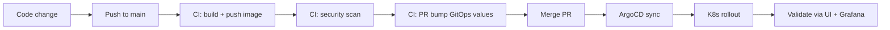

# Value Stream Map (VSM) — Strapi GitOps Delivery

Last updated: 2026-01-25 22:45:56

## Value stream (from idea to running in cluster)



## Steps and “why they matter”

1) **Code change → push**
- Fast feedback; versioned history

2) **CI build + publish (immutable tag = SHA)**
- Reproducible artifacts
- Easy rollbacks and audits

3) **Security scan (Trivy)**
- Detect known CVEs in image layers

4) **GitOps PR bump**
- Git is the source of truth (not the registry)
- Every deploy is a reviewable change

5) **Argo auto-sync**
- No manual `kubectl apply` for deploy
- Self-heal + prune keep cluster clean

6) **Operate + observe**
- Grafana dashboard shows pod health and resource usage
- Quick triage (restarts, replicas, CPU/mem)

## Bottlenecks / opportunities (future improvements)

- Add app-level metrics (requests/latency/error rate)
- Enforce quality gates (fail build on HIGH/CRITICAL if desired)
- Add promotion workflow (dev → stage → prod via PR)

## Access Layer

### Value Stream note: access layer

For the live demo, human-friendly access (`*.apps.home.arpa`) is provided by:
- **Pi-hole** (DNS) → resolves hostnames
- **NPM** (reverse proxy) → routes to NodePorts

### Local DNS + Reverse Proxy (Pi-hole + Nginx Proxy Manager)

This lab uses **Pi-hole as local DNS** and **Nginx Proxy Manager (NPM)** as the reverse proxy for friendly URLs under `*.apps.home.arpa`.

**Flow (browser → app):**
1. Client resolves `strapi.apps.home.arpa` via **Pi-hole**
2. Pi-hole returns the IP of the **NPM** host
3. NPM routes the request to the correct upstream (NodePort / service)

**NPM Proxy Hosts (current):**
| Hostname | Upstream (destination) | Notes |
|---|---:|---|
| `argocd.apps.home.arpa` | `https://192.168.0.100:30443` | Custom cert (TLS) |
| `grafana.apps.home.arpa` | `http://192.168.0.100:30030` | HTTP only |
| `strapi.apps.home.arpa` | `http://192.168.0.101:31337` | HTTP only (Strapi admin) |
| `pihole.apps.home.arpa` | `http://192.168.0.200:80` | Pi-hole UI |
| `proxmox.apps.home.arpa` | `https://192.168.0.11:8006` | Custom cert (TLS) |
| `plex.apps.home.arpa` | `http://192.168.0.210:32400` | Plex UI |
| `nas223.apps.home.arpa` | `http://192.168.0.98:5000` | Synology UI |

> **Note:** Traefik is used only as the **k3s Service LoadBalancer** implementation and exposes `192.168.0.100`, `192.168.0.101`, `192.168.0.102`. External access for the demo uses **Pi-hole + NPM**, not Ingress.

```mermaid
flowchart LR
  U[User Browser] -->|DNS query| P[Pi-hole DNS]
  P -->|A record: NPM IP| U
  U -->|HTTP(S) request| N[Nginx Proxy Manager]
  N -->|proxy_pass to NodePort| K[k3s nodes: 192.168.0.100/101/102]
  K -->|Service/Pod| S[Strapi / ArgoCD / Grafana]
```
